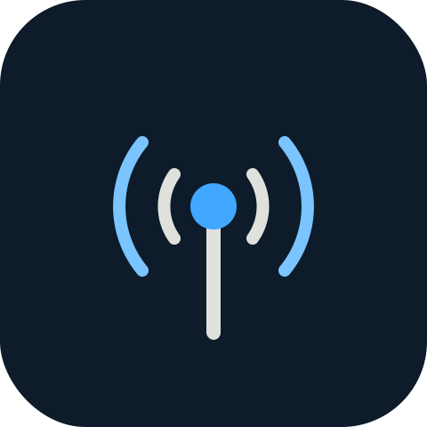

<p align="center">
  
</p>

<h1 align="center">missionctl</h1>

<p align="center">
  <strong>less chatter. full signal.</strong>
</p>

<p align="center">
  <a href="https://github.com/dnl-re/missionctl/stargazers"></a>
  <a href="https://github.com/dnl-re/missionctl/commits/main"></a>
  <a href="LICENSE"></a>
</p>

<p align="center">
  <a href="#before--after">Before/After</a> •
  <a href="#install">Install</a> •
  <a href="#what-you-get">What You Get</a> •
  <a href="#benchmarks">Benchmarks</a> •
  <a href="#credits">Credits</a> •
  <a href="./INSTALL.md">Full install guide</a>
</p>

---

> **missionctl is a respectful fork of [caveman](https://github.com/JuliusBrussee/caveman) by Julius Brussee.**
> Caveman proved that AI agents can communicate far more efficiently while preserving technical accuracy.
> missionctl keeps that core idea and changes only the framing — from caveman-style speech to calm
> operational brevity. See [Credits](#credits). Huge thanks to Julius for the original project.

A [Claude Code](https://docs.anthropic.com/en/docs/claude-code) skill/plugin (also Codex, Gemini, Cursor, Windsurf, Cline, Copilot, 30+ more) that puts agents into operational-brevity mode — cuts **~75% of output tokens**, keeps full technical accuracy. Full signal. Less chatter.

## Before / After

<table>
<tr>
<td width="50%">

### 🗣️ Normal Claude (69 tokens)

> "The reason your React component is re-rendering is likely because you're creating a new object reference on each render cycle. When you pass an inline object as a prop, React's shallow comparison sees it as a different object every time, which triggers a re-render. I'd recommend using useMemo to memoize the object."

</td>
<td width="50%">

###  missionctl (19 tokens)

> "New object ref each render. Inline object prop = new ref = re-render. Wrap in `useMemo`."

</td>
</tr>
<tr>
<td>

### 🗣️ Normal Claude

> "Sure! I'd be happy to help you with that. The issue you're experiencing is most likely caused by your authentication middleware not properly validating the token expiry. Let me take a look and suggest a fix."

</td>
<td>

###  missionctl

> "Bug in auth middleware. Token-expiry check uses `<`, not `<=`. Fix:"

</td>
</tr>
</table>

**Same fix. 75% fewer words. Full signal.**

```
┌─────────────────────────────────────┐
│  TOKENS SAVED          ████████ 75% │
│  TECHNICAL ACCURACY    ████████ 100%│
│  SPEED INCREASE        ████████ ~3x │
│  SIGNAL                ████████ FULL│
└─────────────────────────────────────┘
```

Pick your brevity level — `lite` (drop filler), `full` (default operational brevity), `ultra` (telegraphic), or `wenyan` (classical Chinese, even shorter). One command to switch. Token cost stays low.

**Speak your tongue.** missionctl keeps your language. Write Portuguese, get compressed Portuguese. Spanish, French, same. Compress the *style*, not the language. Code, commands, error strings stay exact.

> "Novo ref de objeto cada render. Prop inline = novo ref = re-render. Envolva com `useMemo`."

## Install

One line. Find every agent. Install for each.

```bash
# macOS / Linux / WSL / Git Bash
curl -fsSL https://raw.githubusercontent.com/dnl-re/missionctl/main/install.sh | bash

# Windows (PowerShell 5.1+)
irm https://raw.githubusercontent.com/dnl-re/missionctl/main/install.ps1 | iex
```

~30 seconds. Needs Node ≥18. Skips agents you don't have. Safe to re-run.

**Trigger:** type `/missionctl` or say "operational brevity mode". Stop with "normal mode".

One agent only, manual command, or any of 30+ other agents → [**INSTALL.md**](./INSTALL.md).
Install breaks? Open your agent, say *"Read CLAUDE.md and INSTALL.md, install missionctl for me."*

## What You Get

| Skill | What |
|---|---|
| `/missionctl [lite\|full\|ultra\|wenyan]` | Compress every reply. Levels stick until session end. |
| `/missionctl-commit` | Conventional Commit messages, ≤50 char subject. Why over what. |
| `/missionctl-review` | One-line PR comments: `L42: 🔴 bug: user null. Add guard.` |
| `/missionctl-stats` | Real session token usage + lifetime savings + USD. Shareable line via `--share`. |
| `/missionctl-compress <file>` | Rewrite a memory file (e.g. `CLAUDE.md`) into compressed form. Cuts ~46% input tokens every session. Code/URLs/paths byte-preserved. |
| `missionctl-shrink` | MCP middleware. Wraps any MCP server, compresses tool descriptions. [npm](https://www.npmjs.com/package/missionctl-shrink). |
| `missioncrew-*` | Compressed subagents (investigator/builder/reviewer). ~60% fewer tokens than vanilla, main context lasts longer. |

**Statusline badge** — Claude Code shows `[missionctl] 📡 12.4k` (lifetime tokens saved). Updates every `/missionctl-stats` run. Set `MISSIONCTL_STATUSLINE_SAVINGS=0` to silence.

Auto-activate every session: Claude Code, Codex, Gemini (built-in). Cursor / Windsurf / Cline / Copilot get always-on rule files via `--with-init`. Other agents trigger with `/missionctl` per session. Full feature matrix in [INSTALL.md](./INSTALL.md#what-you-get).

## Benchmarks

Real token counts from the Claude API. Average **65% output reduction** across 10 prompts (range 22-87%).

<!-- BENCHMARK-TABLE-START -->
| Task | Normal | missionctl | Saved |
|------|-------:|--------:|------:|
| Explain React re-render bug | 1180 | 159 | 87% |
| Fix auth middleware token expiry | 704 | 121 | 83% |
| Set up PostgreSQL connection pool | 2347 | 380 | 84% |
| Explain git rebase vs merge | 702 | 292 | 58% |
| Refactor callback to async/await | 387 | 301 | 22% |
| Architecture: microservices vs monolith | 446 | 310 | 30% |
| Review PR for security issues | 678 | 398 | 41% |
| Docker multi-stage build | 1042 | 290 | 72% |
| Debug PostgreSQL race condition | 1200 | 232 | 81% |
| Implement React error boundary | 3454 | 456 | 87% |
| **Average** | **1214** | **294** | **65%** |
<!-- BENCHMARK-TABLE-END -->

Raw data and reproduction script: [`benchmarks/`](./benchmarks/). Three-arm eval harness (baseline / terse / skill) lives in [`evals/`](./evals/) — missionctl is compared against `Answer concisely.` not against the verbose default, so the delta is honest.

**missionctl-compress receipts** (real memory files):

| File | Original | Compressed | Saved |
|---|---:|---:|---:|
| `claude-md-preferences.md` | 706 | 285 | **59.6%** |
| `project-notes.md` | 1145 | 535 | **53.3%** |
| `claude-md-project.md` | 1122 | 636 | **43.3%** |
| `todo-list.md` | 627 | 388 | **38.1%** |
| `mixed-with-code.md` | 888 | 560 | **36.9%** |
| **Average** | **898** | **481** | **46%** |

> [!IMPORTANT]
> missionctl only affects output tokens — thinking/reasoning tokens are untouched. It makes the *output* shorter, not the reasoning weaker. The biggest win is **readability and speed**; cost savings are a bonus.

A March 2026 paper ["Brevity Constraints Reverse Performance Hierarchies in Language Models"](https://arxiv.org/abs/2604.00025) found that constraining large models to brief responses **improved accuracy by 26 points** on certain benchmarks. Verbose isn't always better. Sometimes fewer words = more correct.

## How It Works

1. Install drops a skill file into your agent.
2. The skill tells the agent: drop filler, keep substance, use fragments.
3. For Claude Code, a hook also writes a tiny flag file each session — the agent sees the flag and stays brief from message one. No need to type `/missionctl`.
4. The stats command reads the Claude Code session log, counts tokens saved, and writes the number to the statusline.
5. The compress sub-skill rewrites memory files (CLAUDE.md, project notes) so each session starts with a smaller context. Saves tokens every session, not just one reply.

Maintainer details (hook architecture, file ownership, CI sync) live in [CLAUDE.md](./CLAUDE.md).

## OpenClaw

[**OpenClaw**](https://openclaw.ai) is a self-hosted gateway running many agents in one box (Claude Code, Codex, Pi, OpenCode), wired to Slack / Discord / iMessage / Telegram. missionctl installs into it with the same canonical installer, scoped to one agent:

```bash
# macOS / Linux / WSL
curl -fsSL https://raw.githubusercontent.com/dnl-re/missionctl/main/install.sh | bash -s -- --only openclaw

# Windows (PowerShell): no Node? install Node ≥18 first, then
npx -y github:dnl-re/missionctl -- --only openclaw
```

Two things happen, no more:

1. **Skill drop** at `~/.openclaw/workspace/skills/missionctl/SKILL.md` — spec-correct frontmatter (`version`, `always: true`), discoverable by `openclaw skills list`.
2. **SOUL.md nudge.** A small marker-fenced block appended to `~/.openclaw/workspace/SOUL.md`, which OpenClaw injects into every turn under "Project Context". Brief from message one, no `/missionctl` per session.

```
~/.openclaw/workspace/
├── skills/missionctl/SKILL.md   ← full ruleset, on-demand load
└── SOUL.md                      ← <!-- missionctl-begin --> ... <!-- missionctl-end -->
                                   ↑ auto-injected every turn
```

Custom workspace path? Set `OPENCLAW_WORKSPACE=/your/path` before the command. Uninstall: same one-liner with `--uninstall`. Idempotent re-runs.

## Credits

missionctl is a respectful fork of [**caveman**](https://github.com/JuliusBrussee/caveman) by **Julius Brussee**.
Caveman proved that AI agents can communicate far more efficiently while preserving technical accuracy.
missionctl keeps that core idea and the original implementation pattern, and changes only the framing:
from caveman-style speech to calm operational brevity. The compression concept, architecture, hooks,
and skill design all originate with caveman. **Huge thanks to Julius for the original project.**

If you want the original caveman experience and its wider ecosystem (caveman-code, cavemem, cavekit,
and more), go support the upstream project: <https://github.com/JuliusBrussee/caveman>.

## Migration from caveman

If you're moving from caveman, the mapping is mechanical:

| caveman | missionctl |
|---|---|
| `/caveman [lite\|full\|ultra]` | `/missionctl [lite\|full\|ultra]` |
| `/caveman-commit` · `/caveman-review` · `/caveman-stats` · `/caveman-compress` | `/missionctl-commit` · `/missionctl-review` · `/missionctl-stats` · `/missionctl-compress` |
| `caveman-shrink` (MCP) | `missionctl-shrink` |
| `cavecrew-*` subagents | `missioncrew-*` subagents |
| `~/.config/caveman/config.json` | `~/.config/missionctl/config.json` |
| `.caveman-active` / `.caveman-history.jsonl` flags | `.missionctl-active` / `.missionctl-history.jsonl` |
| `CAVEMAN_DEFAULT_MODE`, `CAVEMAN_SHRINK_*`, `CAVEMAN_STATUSLINE_SAVINGS` | `MISSIONCTL_DEFAULT_MODE`, `MISSIONCTL_SHRINK_*`, `MISSIONCTL_STATUSLINE_SAVINGS` |

Mode names (`lite`, `full`, `ultra`, `wenyan-*`) are unchanged. Behavior is unchanged — only the framing and names differ.

## Links

- [INSTALL.md](./INSTALL.md) — full install matrix, all flags, per-agent detail
- [CONTRIBUTING.md](./CONTRIBUTING.md) — how to send a patch
- [CLAUDE.md](./CLAUDE.md) — maintainer guide (file ownership, hook architecture, CI)
- [docs/](./docs/) — extra guides (Windows install, etc.)
- [Issues](https://github.com/dnl-re/missionctl/issues) — bugs, features, weird behavior

## License

MIT. See [LICENSE](LICENSE) — copyright is retained for both the original caveman author and the missionctl fork.
