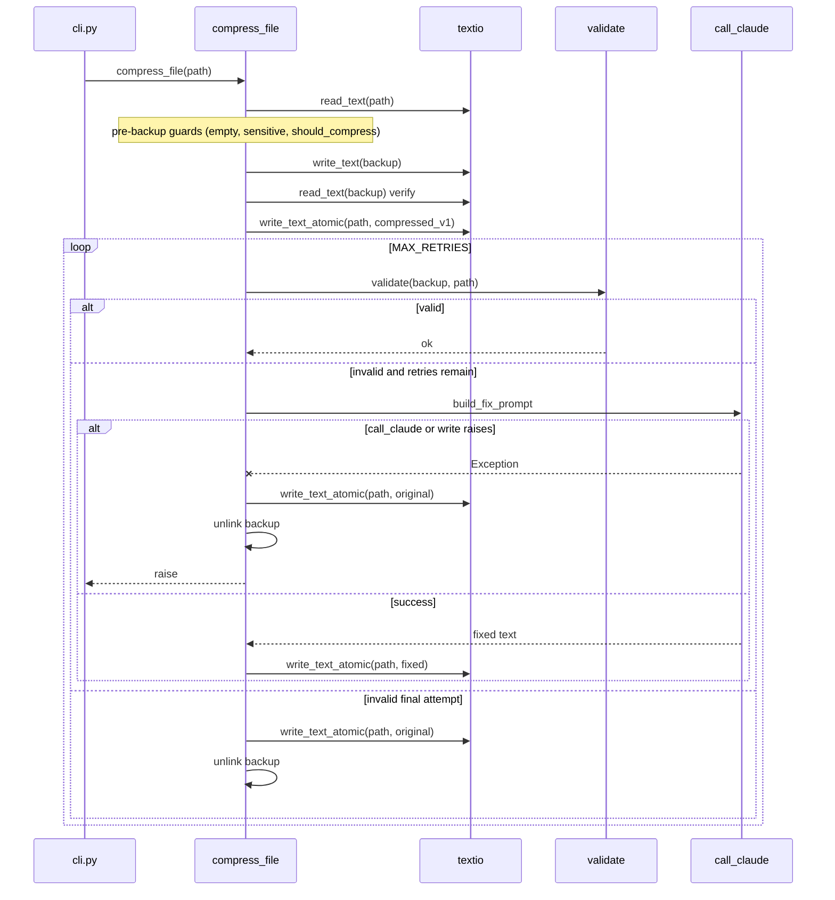

## Goal Capsule

Fix **caveman-compress** so UTF-8 markdown (Korean, emoji, arrows, box-drawing) round-trips correctly on Windows locale codepages (`cp1252`, `cp949`, etc.) and so any exception during the validation/fix-retry loop **never** leaves the live target file in a corrupted or truncated state.

**Authority:** Issues [#686](https://github.com/JuliusBrussee/caveman/issues/686) and [#766](https://github.com/JuliusBrussee/caveman/issues/766).

**Stop conditions:** All verification commands pass; new regression tests cover encoding and crash-restore paths; only `skills/caveman-compress/` sources are edited (CI mirrors to `plugins/`).

---

## Product Contract

### Summary

On Windows, `caveman-compress` reads and writes markdown using Python's locale-default encoding instead of UTF-8. That silently corrupts non-ASCII content and can truncate files to zero bytes when `write_text` opens the target for write and encoding fails mid-flight. A second failure mode: if the fix-retry `call_claude` step raises, the generic CLI handler exits without restoring `original_text`, leaving the user with a half-compressed file and no recovery path except git.

This plan closes both issue families in one focused change set: explicit UTF-8 I/O everywhere in the compress skill scripts, atomic target writes, and guaranteed restore on any post-backup failure.

### Requirements

- R1. Every `Path.read_text()` / `Path.write_text()` in `skills/caveman-compress/scripts/compress.py`, `validate.py`, and `detect.py` must use UTF-8 explicitly.
- R2. File reads must not use `errors="ignore"` — invalid UTF-8 in a source file must fail loudly instead of silently dropping bytes (see KTD1).
- R3. Writes to the **live target file** (`filepath`) must be atomic (write temp + `os.replace`) so an encode/write failure cannot truncate the original to 0 bytes.
- R4. After a verified backup exists and the target has been mutated, **any** exception in the validation/fix-retry loop (including `call_claude` failures) must restore `original_text` to the target and remove the backup before the error propagates to `cli.py`.
- R5. Existing pre-backup safety guards (empty input refusal, identical-output abort, backup readback verification) must remain unchanged in behavior.
- R6. Regression tests must prove UTF-8 round-trip under simulated non-UTF-8 locale defaults and prove restore-on-exception during fix-retry.
- R7. Edits apply only to the source-of-truth tree under `skills/caveman-compress/`; `plugins/caveman/skills/caveman-compress/` is CI-rebuilt.

### Actors

- A1. **Windows developer** running `python -m scripts <file.md>` or the installed caveman-compress skill on UTF-8 markdown containing non-ASCII text.
- A2. **Maintainer** running `tests/verify_repo.py` and unit tests in CI.

### Key Flows

- F1. **Happy path:** Read UTF-8 source → backup verified → compress → validate passes → target retains valid compressed UTF-8, backup holds exact original bytes.
- F2. **Validation retry:** First write fails validation → fix prompt → second write succeeds → target updated, backup removed on success path (current behavior).
- F3. **Validation exhausted:** All retries fail → restore `original_text`, delete backup (current behavior on last attempt only — preserved).
- F4. **Crash during fix-retry (new):** `call_claude` or `write_text` raises mid-retry → restore `original_text`, delete backup, re-raise → CLI prints error but file matches pre-run content.

### Acceptance Examples

- AE1. Given a UTF-8 markdown file containing `→`, `⚠️`, and Korean text on a machine whose preferred encoding is `cp1252` or `cp949`, when compression runs with a mocked successful Claude response, then the on-disk target and backup are byte-identical round-trips of the expected UTF-8 content with zero replacement characters.
- AE2. Given compression has written a failing compressed draft and entered fix-retry, when `call_claude` raises `UnicodeEncodeError` or `RuntimeError`, then the target file content equals the pre-run `original_text` and the backup file is removed.
- AE3. Given a write to the target would fail encoding, when the atomic write helper runs, then the original target file bytes are unchanged (no truncate-to-zero).

### Scope Boundaries

**In scope**

- `skills/caveman-compress/scripts/compress.py`, `validate.py`, `detect.py`
- New shared helper module for UTF-8 I/O (see KTD2)
- Unit tests in `tests/test_compress_safety.py` (extend) and new `tests/test_compress_encoding.py`
- Optional consistency fix: `skills/caveman-compress/scripts/benchmark.py` read paths

**Deferred for later**

- Changing `cli.py` to restore on exceptions thrown *before* backup creation (already safe today)
- Broader repo-wide audit of encoding outside caveman-compress
- Adding `PYTHONUTF8=1` documentation for Windows users (helpful but not a substitute for explicit encoding)

**Outside this product's identity**

- OpenCode install issues, opencode schema mismatches, or other caveman sub-skills

---

## Planning Contract

### Key Technical Decisions

- KTD1. **Drop `errors="ignore"` on reads** (session-settled: issue evidence — chosen over keeping `errors="ignore"` with UTF-8: silent byte dropping caused irreversible mojibake when decoding was already wrong). With `encoding="utf-8"` and default `errors="strict"`, corrupt files surface as `UnicodeDecodeError` before any backup or mutation. Governs R2.
- KTD2. **Introduce `scripts/textio.py` shared helpers** (chosen over sprinkling `encoding="utf-8"` at 8+ call sites: single place for UTF-8 policy, atomic write, and future BOM handling). Exports at minimum:
  - `read_text(path: Path) -> str` — `encoding="utf-8"`
  - `write_text(path: Path, text: str) -> None` — `encoding="utf-8"` (for backup files)
  - `write_text_atomic(path: Path, text: str) -> None` — temp sibling + `os.replace`
  Governs R1, R3.
- KTD3. **Restore helper + try/except around fix-retry body** (chosen over only wrapping `call_claude`: write failures during retry must also restore). Add `_restore_original(filepath, original_text, backup_path)` called from:
  1. existing last-attempt validation-failure branch (refactor to use helper)
  2. new `except Exception` around each retry iteration's `call_claude` + target write
  Governs R4.
- KTD4. **Test locale simulation via `locale.getpreferredencoding` patch + UTF-8 bytes on disk** (chosen over requiring Windows CI agents: reproduces the default-encoding bug on Linux/macOS runners). Governs R6.

### Assumptions

- Source markdown files are UTF-8 (industry default for `.md` in dev tooling). Non-UTF-8 legacy files may now error instead of corrupt — acceptable trade per KTD1.
- `os.replace` on the target's parent directory is same-volume on Windows user paths (standard for in-place markdown edits).

### High-Level Technical Design



**State after backup verification**

| Phase | Target file | Backup file | On any exception |
|-------|-------------|-------------|------------------|
| Before backup | original | none | no-op |
| After backup, before target write | original | original copy | delete backup only |
| After first target write | compressed draft | original copy | restore original + delete backup |

### Risks and Mitigation

| Risk | Mitigation |
|------|------------|
| Strict UTF-8 rejects legit legacy encodings | Document in PR; error message is actionable ("file is not valid UTF-8") |
| Atomic write leaves `.tmp` on crash | `finally: tmp.unlink(missing_ok=True)` in helper |
| Duplicate restore logic | Single `_restore_original` used by final-failure and exception paths |
| Plugins copy drift | Edit only `skills/`; note in PR that CI sync-skill workflow rebuilds mirror |

---

## Implementation Units

### U1. Add UTF-8 text I/O helpers

**Goal:** Centralize encoding and atomic-write policy.

**Requirements:** R1, R2, R3

**Dependencies:** none

**Files:**
- `skills/caveman-compress/scripts/textio.py` (create)
- `skills/caveman-compress/scripts/__init__.py` (no change expected)

**Approach:**
1. Implement `read_text`, `write_text`, `write_text_atomic` per KTD2.
2. `write_text_atomic`: write to `path.with_name(path.name + ".tmp")`, then `os.replace(tmp, path)`; always clean up temp in `finally`.
3. Do not add BOM handling unless a test proves it is needed.

**Patterns to follow:** Existing explicit `encoding="utf-8"` usage in `tests/verify_repo.py` and `call_claude` subprocess kwargs in `compress.py` (issue #152 precedent).

**Test scenarios:**
- `write_text_atomic` leaves original bytes untouched when inner write raises (mock `Path.write_text` to raise on second call).
- Round-trip Korean + emoji string through `write_text` / `read_text` preserves exact codepoints.

**Verification:** Import helpers from a one-liner in REPL; no side effects.

---

### U2. Wire UTF-8 I/O through compress orchestrator

**Goal:** Fix root encoding bug and crash-safe retry in `compress_file`.

**Requirements:** R1–R5, R4

**Dependencies:** U1

**Files:**
- `skills/caveman-compress/scripts/compress.py` (modify)

**Approach:**
1. Replace all `filepath.read_text(errors="ignore")`, `backup_path.write_text`, `backup_path.read_text`, and `filepath.write_text` with `textio` helpers.
2. Use `write_text` for backup (new file); `write_text_atomic` for all target mutations.
3. Extract `_restore_original(filepath, original_text, backup_path)` calling atomic write + `backup_path.unlink(missing_ok=True)`.
4. Refactor existing final-retry failure branch to call `_restore_original`.
5. Wrap the fix-retry body (`call_claude` + target write) in `try/except Exception`: on failure, call `_restore_original`, then re-raise.
6. Leave pre-backup logic (empty check, sensitive path, `should_compress`, empty Claude response, identical output) untouched.

**Execution note:** Extend `tests/test_compress_safety.py` before refactoring restore paths — add the exception-restore test first (characterization), then implement U2.

**Test scenarios:**
- Covers F4 / AE2: mock `call_claude` to succeed once then raise on fix-retry; assert target equals original and backup gone.
- Covers AE1: with `locale.getpreferredencoding` patched to `cp1252`, UTF-8 bytes on disk round-trip without ``.
- Existing safety tests in `test_compress_safety.py` continue to pass unchanged.

**Verification:** `python3 -m unittest tests.test_compress_safety -v`

---

### U3. Fix validate.py and detect.py reads

**Goal:** Validation and detection use the same UTF-8 policy as compression.

**Requirements:** R1, R2

**Dependencies:** U1

**Files:**
- `skills/caveman-compress/scripts/validate.py` (modify)
- `skills/caveman-compress/scripts/detect.py` (modify)

**Approach:**
1. `validate.read_file` → delegate to `textio.read_text`.
2. `detect_file_type` extensionless sniff → `textio.read_text` inside existing `try/except (OSError, PermissionError)`.

**Test scenarios:**
- Extensionless UTF-8 Korean `CLAUDE` file (no extension) still classified `natural_language` when content is prose.
- `validate()` compares UTF-8 original/compressed fixtures without corruption when paths contain non-ASCII content in body.

**Verification:** `python3 -m unittest tests.test_detect -v`; fixture pass via `verify_compress_fixtures`.

---

### U4. Align benchmark.py reads (consistency)

**Goal:** Remove remaining locale-default reads in the compress skill package.

**Requirements:** R1 (partial)

**Dependencies:** U1

**Files:**
- `skills/caveman-compress/scripts/benchmark.py` (modify)

**Approach:** Replace `orig_path.read_text()` / `comp_path.read_text()` with `textio.read_text`.

**Test expectation:** none — mechanical consistency; covered by `verify_compress_fixtures` indirect use of validate.

**Verification:** `python3 skills/caveman-compress/scripts/benchmark.py` against `tests/caveman-compress/*.original.md` pairs runs without error.

---

### U5. Add encoding regression test module

**Goal:** Dedicated tests for Windows encoding class of bugs (#686, #766).

**Requirements:** R6

**Dependencies:** U2, U3

**Files:**
- `tests/test_compress_encoding.py` (create)

**Approach:**
1. Follow import/bootstrap pattern from `tests/test_compress_safety.py` (`sys.path` → `skills/caveman-compress`).
2. Test matrix:
   - UTF-8 file with `→`, `✅`, Korean hangul round-trips under mocked `cp1252` preferred encoding.
   - Simulated `UnicodeEncodeError` during fix-retry triggers restore (may share helper with U2 tests if not already in `test_compress_safety.py`).
   - Atomic write: if replace-target write fails, original content length unchanged.

**Test scenarios:** As listed in U2/U5; keep tests hermetic (mock `call_claude`, mock `backup_dir_for` with temp `XDG_DATA_HOME` like existing safety tests).

**Verification:** `python3 -m unittest tests.test_compress_encoding -v`

---

## Verification Contract

Run from repo root (`JuliusBrussee/caveman`):

```bash
# Unit tests (compress-focused)
python3 -m unittest tests.test_compress_safety tests.test_detect tests.test_compress_encoding -v

# Broader local gate used by maintainers
python3 tests/verify_repo.py
```

**CI expectation:** Existing GitHub Actions should pass; no workflow changes required. `sync-skill.yml` will copy updated scripts to `plugins/caveman/skills/caveman-compress/` on merge to `main`.

**Manual smoke (optional, Windows):** On a Windows machine with non-UTF-8 locale, compress a `.md` file containing `→` and Korean text with `ANTHROPIC_API_KEY` unset (CLI fallback path). Confirm no `UnicodeEncodeError` and no `` in output.

---

## Definition of Done

- [ ] All R1–R7 satisfied
- [ ] `textio.py` is the only encoding policy surface for compress scripts
- [ ] Issues #686 and #766 root causes addressed (PR body references both with `Fixes #686` and `Fixes #766`)
- [ ] `python3 -m unittest tests.test_compress_safety tests.test_detect tests.test_compress_encoding -v` passes
- [ ] `python3 tests/verify_repo.py` passes
- [ ] No edits under `plugins/caveman/skills/caveman-compress/` (CI-owned)
- [ ] PR explains strict UTF-8 read behavior change for invalid-encoded files

---

## Appendix

### Issue overlap

| Issue | Primary symptom | Addressed by |
|-------|-----------------|--------------|
| #686 | Locale-default I/O corrupts UTF-8; 0-byte truncate on encode fail | U1, U2, U3, KTD1, KTD2 |
| #766 | Mojibake + no restore when fix-retry raises | U2, KTD3 |

### Call sites before fix (grep snapshot, 2026-07-30)

`compress.py`: lines 249, 303–304, 313, 331, 340 — all missing `encoding="utf-8"`.

`validate.py`: line 31 — `read_text(errors="ignore")`.

`detect.py`: line 93 — `read_text(errors="ignore")`.

`benchmark.py`: lines 26–27 — bare `read_text()`.

### Related prior art in repo

- `compress.py` `call_claude` already sets `encoding="utf-8"` on subprocess (issue #152).
- `cli.py` reconfigures stdout/stderr to UTF-8 but does not fix file I/O.
- `tests/test_compress_safety.py` pins pre-backup guards (issue #237); extend for post-backup exception safety.
